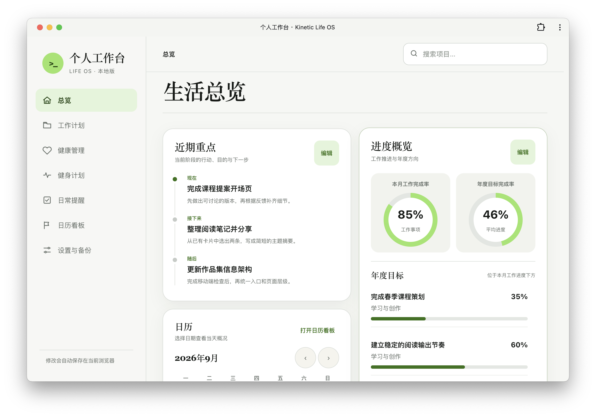
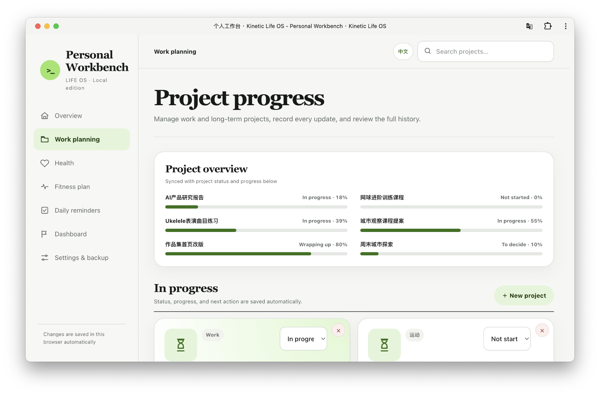
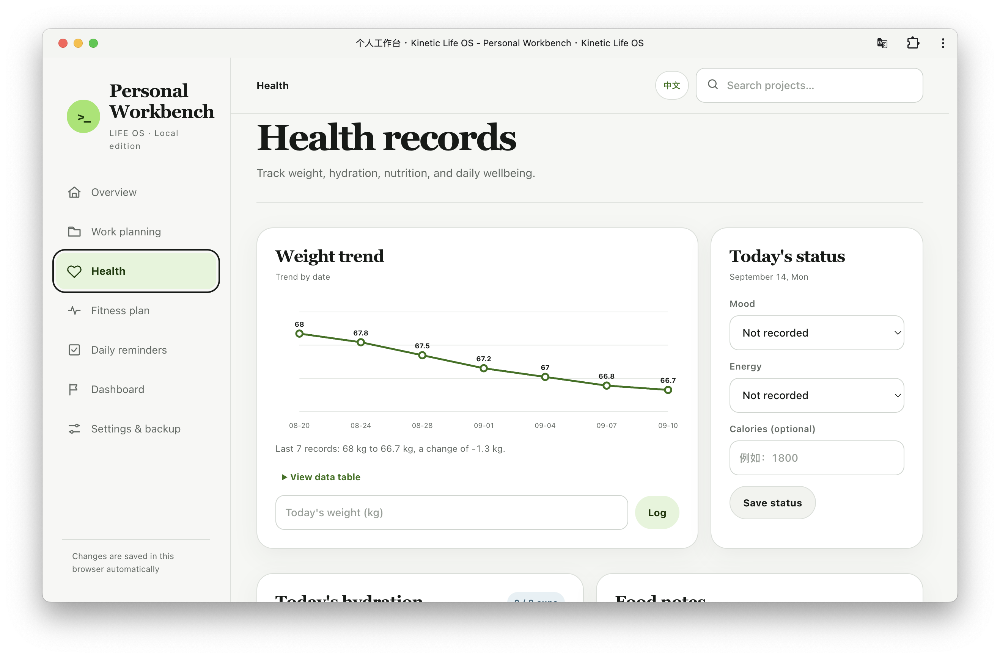
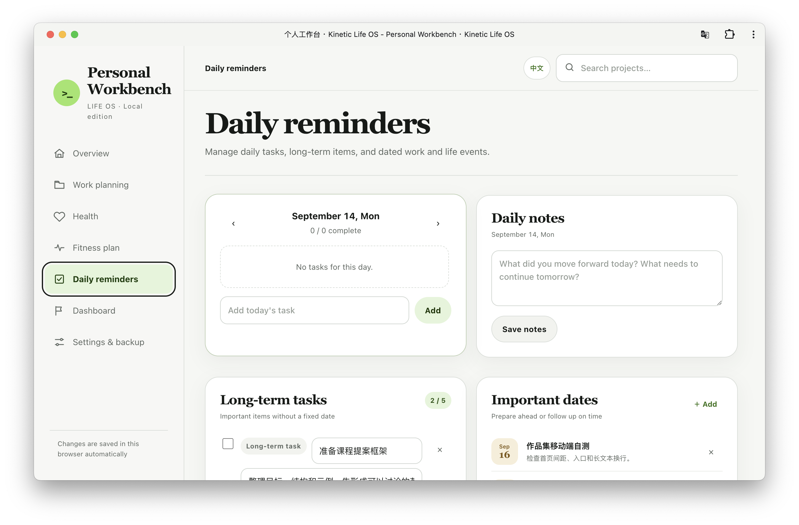
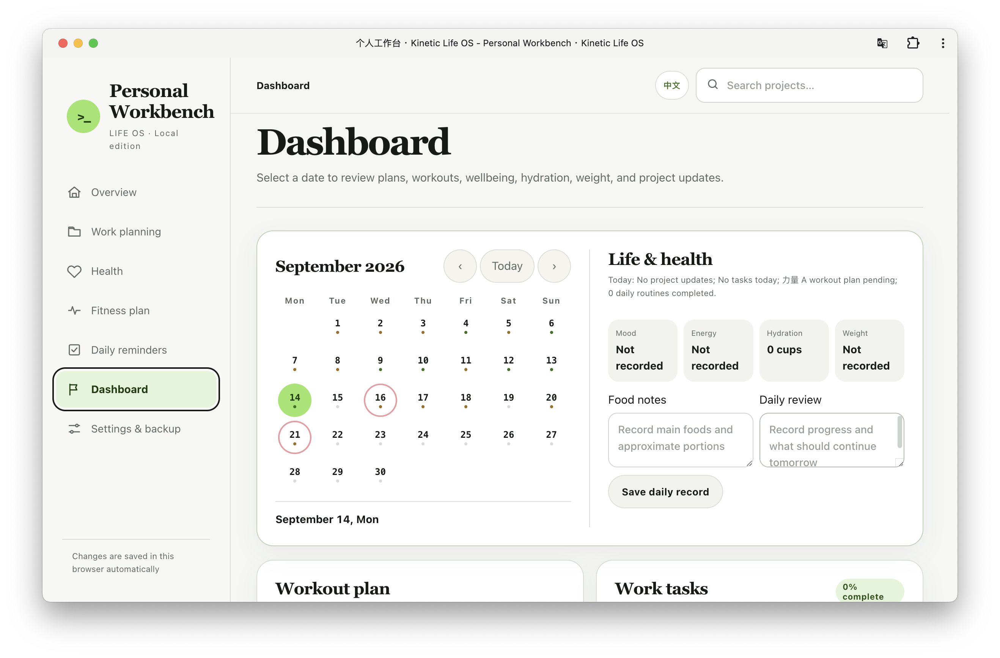
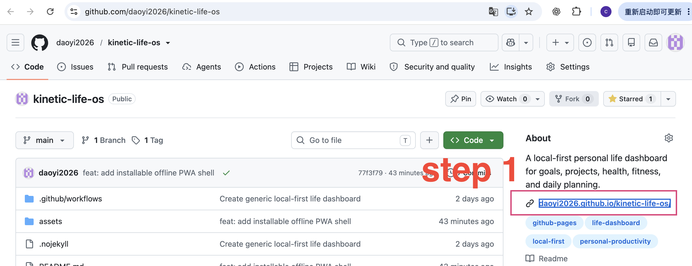
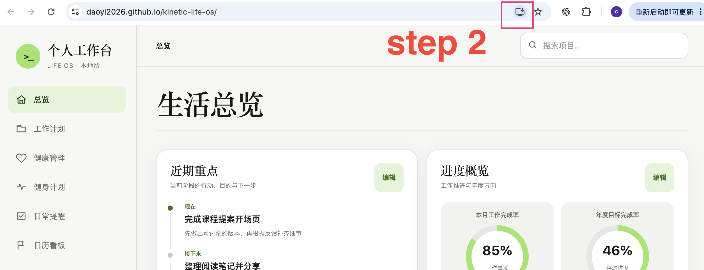

# Kinetic Life OS

个人工作台 · 本地优先 / Personal life dashboard · local-first

当前版本：v1.1（正式版） 
Current release: v1.1 (stable)

## 产品介绍 / Product overview

Kinetic Life OS 是一个本地优先的个人工作台，把目标、项目推进、日历、每日待办、健康记录和健身计划放在同一个可回顾的界面里。它用日期串联行动、状态和复盘，帮助你从今天的具体任务看到项目的长期进展。产品不要求账号或云端同步，数据默认保存在当前浏览器，适合个人使用和自托管。

Kinetic Life OS is a local-first personal dashboard that brings goals, project progress, calendar review, daily tasks, health records, and fitness planning into one reflective workspace. It connects actions, status, and reviews through dates, helping you move from today's concrete tasks to long-term progress. No account or cloud sync is required; data is stored in the current browser by default, making it suitable for personal use and self-hosting.

## 主要界面 / Main screens

### 总览 / Overview

集中查看近期重点、项目进度、年度目标和日历概况。 
See current priorities, project progress, annual goals, and calendar highlights in one place.

### 工作计划 / Work planning

以项目状态、完成进度、标签和下一步行动为核心，持续记录项目推进过程。 
Track project status, progress, tags, and next actions while keeping a complete history of project development.

### 健康记录 / Health records

记录体重、饮水、饮食和每日状态，并通过趋势图观察连续变化。 
Record weight, hydration, nutrition, and daily wellbeing, then use trend views to observe changes over time.

### 日常提醒 / Daily reminders

管理当天待办、长期待办和重要日期，把需要行动的事项集中在一个页面。 
Manage daily tasks, long-term items, and important dates in one place so every actionable item stays visible.

### 日历看板 / Calendar dashboard

按日期集中查看当天计划、运动、状态、饮水、体重、重要日期和项目推进。 
Use the selected date to review plans, workouts, wellbeing, hydration, weight, important dates, and project updates together.

## 核心功能 / Key features

- 目标与项目进度：查看年度方向、项目状态、完成进度和推进历史。 
  Goals and project progress: review annual direction, project status, completion, and update history.
- 每日待办与长期待办：管理当天行动，并将完成项目归档到已完成项目。 
  Daily and long-term tasks: manage today's actions and archive completed items in the completed-projects view.
- 日历联动：按日期汇总工作、健康、训练和重要日期信息。 
  Calendar integration: summarize work, health, fitness, and important-date information by day.
- 健康记录：记录心情、精力、饮水、饮食、体重和体重趋势。 
  Health records: track mood, energy, hydration, nutrition, weight, and weight trends.
- 健身计划：管理每周训练安排、日常项目、专项训练和完成情况。 
  Fitness planning: manage weekly schedules, daily routines, focused training, and completion status.
- 数据备份：支持 JSON 导出与导入，便于手动备份和迁移。 
  Data backup: export and import JSON files for manual backup and migration.
- 响应式布局：适配桌面、平板和移动端浏览器。 
  Responsive layout: works across desktop, tablet, and mobile browsers.

## 产品使用说明 / How to use

1. 打开产品链接，先从“总览”查看当天重点和整体进度。 
   Open the product link and start from “Overview” to see today's priorities and overall progress.
2. 在“工作计划”中创建项目，设置项目状态、进度、标签、描述和下一步行动。 
   In “Work planning”, create projects and set their status, progress, tags, description, and next action.
3. 在“日常提醒”中维护当天待办；完成后勾选，已完成项目会从当前列表归档。 
   In “Daily reminders”, maintain today's tasks; completed items are checked off and archived from the active list.
4. 在“日历看板”中切换日期，集中检查当天工作、健康、训练和重要日期。 
   In “Calendar dashboard”, switch dates to review work, health, fitness, and important dates together.
5. 在“健康管理”中记录状态、饮水、饮食和体重，使用趋势图观察变化。 
   In “Health management”, record wellbeing, hydration, nutrition, and weight, then review changes in the trend chart.
6. 在“健身计划”中编辑每周训练、日常项目和专项训练；同一星期几的计划会按周重复。 
   In “Fitness planning”, edit weekly workouts, daily routines, and focused training; each weekday plan repeats weekly.
7. 定期在“设置与备份”中导出 JSON 文件，换设备或浏览器时再导入。 
   Regularly export a JSON file in “Settings & backup”, then import it when moving to another device or browser.

## 安装为 PWA / Install as a PWA

PWA 是可安装的网页应用。打开部署后的 HTTPS 地址后，可以把 Kinetic Life OS 安装到桌面、Dock、开始菜单或手机主屏幕；安装后可以独立窗口打开，并在首次成功访问后使用已缓存的应用壳离线启动。 
A PWA is an installable web application. Open the deployed HTTPS URL and install Kinetic Life OS to the desktop, Dock, Start menu, or phone home screen. It opens in its own app window and can launch from its cached application shell after the first successful visit.

### 安装步骤 / Installation steps

1. 在 GitHub 仓库右侧 About 区域点击产品链接。 
   Click the product link in the About section on the GitHub repository page.

2. 进入产品页面后，点击浏览器地址栏右侧的安装图标，确认安装。 
   On the product page, click the install icon on the right side of the browser address bar and confirm the installation.

在 Mac 和 Windows 上推荐使用最新版 Chrome 或 Edge；iPhone/iPad 可使用 Safari 的“添加到主屏幕”，Android 可使用 Chrome 的“安装应用”。 
The latest Chrome or Edge is recommended on Mac and Windows. On iPhone/iPad, use Safari's “Add to Home Screen”; on Android, use Chrome's “Install app”.

## 数据与隐私 / Data and privacy

所有用户输入的数据默认保存在当前浏览器的 `kinetic-life-os:data:v1` 存储键中。应用没有账号系统、后端、分析服务或云端同步。 
User-entered data is stored in the current browser under the `kinetic-life-os:data:v1` storage key by default. The application has no account system, backend, analytics service, or cloud synchronization.

浏览器存储可能被用户清除，也可能受到隐私模式或浏览器存储策略影响。建议定期导出 JSON 备份，并在更换设备或浏览器时导入。 
Browser storage can be cleared by the user and may be affected by private browsing or browser storage policies. Export a JSON backup regularly and import it when moving to another device or browser.

## 本地预览与部署 / Local preview and deployment

使用任意静态 Web 服务器提供此目录，并通过服务器地址打开 `index.html`。不建议直接使用 `file://` 打开，因为不同浏览器对本地文件的存储行为可能不同。 
Serve this directory with any static web server and open `index.html` through the server URL. Direct `file://` usage is not recommended because browser storage behavior can vary.

仓库内置 GitHub Actions 工作流，每次推送到 `main` 分支后会自动发布为 GitHub Pages 静态站点。 
The repository includes a GitHub Actions workflow that publishes the project as a static GitHub Pages site after each push to `main`.

PWA 安装不会增加账号系统或云端同步，用户数据仍然属于当前浏览器配置文件。 
PWA installation does not add an account system or cloud synchronization; user data remains tied to the current browser profile.

## 安全提示 / Security notes

- 不要输入密码、身份证件、支付信息或其他高度敏感信息。 
  Do not enter passwords, identity documents, payment data, or other highly sensitive information.
- 用户生成的内容会在渲染前进行转义。 
  User-generated content is escaped before it is rendered.
- 生产页面使用限制性的内容安全策略，并且不加载第三方脚本。 
  The production page uses a restrictive Content Security Policy and loads no third-party scripts.
- 仓库源代码只包含通用演示数据。 
  The repository source contains generic demonstration data only.

尚未选择开源许可证。 
No open-source license has been selected yet.
