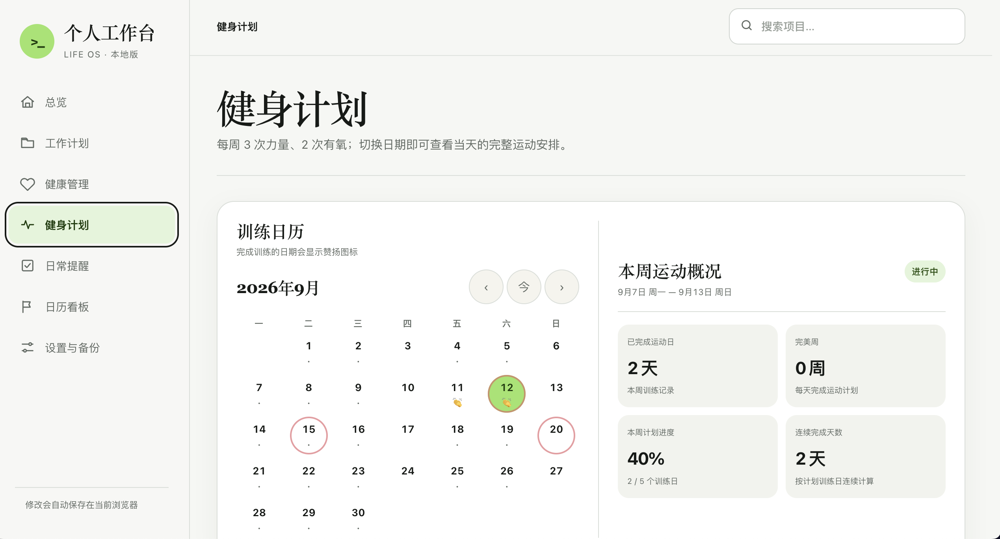

# Kinetic Life OS

当前版本：v1.0（正式版）

## 产品介绍

Kinetic Life OS 是一个本地优先的个人工作台，把目标、项目推进、日历、每日待办、健康记录和健身计划放在同一个可回顾的界面里。它用日期串联行动、状态和复盘，帮助你从今天的具体任务看到项目的长期进展。产品不要求账号或云端同步，数据默认保存在当前浏览器，适合个人使用和自托管。

## 主要界面

### 总览

集中查看近期重点、项目进度、年度目标和日历概况。

### 工作计划

以项目状态、完成进度和下一步行动为核心，持续记录项目推进过程。

### 健身计划

查看训练日历、运动日统计、周度进度和完整训练安排。

Kinetic Life OS is a lightweight, local-first personal dashboard for goals, projects, daily tasks, calendar review, health notes, and workout planning.

## Features

- Goals and project progress with history
- Daily tasks, long-term reminders, and dated events
- Calendar-based daily overview
- Local health, hydration, weight, and workout records
- JSON export and import for manual backup
- Responsive desktop and mobile layouts

## Data model

All user-entered data stays in the current browser under the storage key `kinetic-life-os:data:v1`. The application has no account system, backend, analytics, or cloud synchronization.

Browser storage can be cleared by the user, private browsing mode, or browser storage policies. Users should export a JSON backup regularly and import it when moving to another device or browser.

## Local preview

Serve this directory with any static web server and open `index.html` through that server. Direct `file://` usage is not recommended because browser storage behavior can differ.

## Deployment

The included GitHub Actions workflow publishes the repository as a static GitHub Pages site after every push to `main`.

## Progressive Web App

The site includes a web app manifest and a service worker. On a supported browser, open the deployed HTTPS URL and choose the browser's install action to add Kinetic Life OS to the desktop, Dock, Start menu, or home screen. The service worker caches the application shell for offline launches after the first successful visit.

PWA installation does not add an account system or cloud synchronization. User data remains local to the browser profile, so use the built-in JSON export before moving to another browser or device.

## Security and privacy

- Do not enter passwords, identity documents, payment data, or other highly sensitive information.
- User-generated content is escaped before being inserted into rendered HTML.
- The production page uses a restrictive Content Security Policy and loads no third-party scripts.
- Repository source contains generic demonstration data only.

No license has been selected yet.
