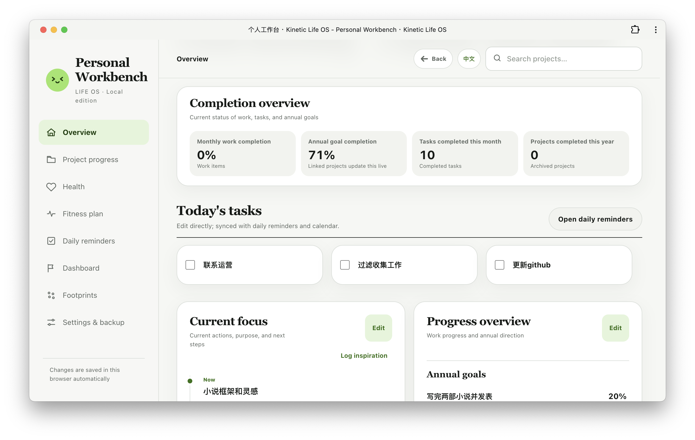

# Kinetic Life OS

个人工作台 · 把自己作为项目 / A personal workbench for turning everyday actions into a visible trajectory

当前版本：v1.4.2 
Current release: v1.4.2

[在线体验 / Live PWA](https://daoyi2026.github.io/kinetic-life-os/) · [GitHub 仓库 / Repository](https://github.com/daoyi2026/kinetic-life-os)

## 产品介绍 / Product overview

Kinetic Life OS 是一个本地优先的个人工作台。它把项目、待办、健康、训练、日历和灵感记录放在同一个可回顾的系统里：今天完成的一件小事、一次身体状态记录或一句突然出现的灵感，都会成为之后回看自己轨迹的一部分。

Kinetic Life OS is a local-first personal workbench for projects, tasks, health, fitness, calendar review, and inspiration. It connects small actions, daily states, and long-term direction without turning personal life into a noisy productivity dashboard.

## 当前工作台 / Current workspace

### 总览 / Overview

查看完成概览、今天要做、近期重点、年度目标和日历。首页的“微风指南”内容会每小时随机轮换一次，提示语缓慢淡入淡出；近期重点和年度目标可以直接编辑，并与其他页面联动。

Review completion status, today's tasks, current priorities, annual goals, and the calendar in one place. The overview's Breeze guide rotates to a random entry every hour with a slow fade transition. Priorities and annual goals can be edited directly and stay linked to the rest of the workspace.

### 项目推进 / Project progress

创建和管理长期项目，设置状态、领域、完成进度、回顾日期和下一步行动。项目总进度会实时汇总，项目卡片保留推进历史，也支持按状态和领域筛选。

Create and manage long-term projects with status, area, progress, review dates, and next actions. The project overview updates from the project cards, while each project keeps its own update history and can be filtered by status or area.

### 健康管理 / Health records

记录体重、心情、精力、饮食热量、饮水和饮食简记，并通过趋势面板观察连续变化。数据只保存在当前浏览器。

Track weight, mood, energy, calories, hydration, and food notes, then review changes through trend panels. Health data stays in the current browser.

### 健身计划 / Fitness plan

按每周 3 次力量训练、2 次有氧训练的节奏安排运动。训练日历、每日训练、早晚维护项目和专项训练都可以按日期查看或更新，并记录完成情况。

Plan three strength sessions and two cardio sessions each week. Browse the training calendar, daily workout plan, morning and evening routines, and supplemental exercises by date, then mark completion as you go.

### 日常提醒 / Daily reminders

在一个页面里处理当天待办、长期待办、重要日期和今日灵感。重要日期支持每周、每月和每年重复；长期事项可以编辑、完成和归档。

Manage daily tasks, long-term tasks, important dates, and today's inspiration in one place. Important dates can repeat weekly, monthly, or yearly; long-term items can be edited, completed, and archived.

### 日历看板 / Calendar dashboard

选择任意日期，集中查看当天计划、训练、身体状态、饮水、体重、项目推进和灵感记录。日历页也可以补记当天事项与复盘。

Select any date to review plans, workouts, wellbeing, hydration, weight, project updates, and inspiration together. You can also add tasks and daily reflections from the calendar view.

### 行则将至 / Inspiration trail

把每天留下的灵感看成一条慢慢形成的轨迹。灵感网格支持年份和月份筛选、两档格子大小切换；点击绿色格子可以打开当天的记录，展开后可以滚动查看完整记录和相关统计。

The Inspiration trail turns daily ideas into a slowly forming visual path. Filter by year or month, switch between two grid sizes, click a green cell to open that day's record, and expand the panel to browse the full record list and metrics.

## 设计与数据原则 / Design and data principles

- **本地优先 / Local-first**：不需要账号、后端或云端同步，记录默认保存在当前浏览器。 
  No account, backend, or cloud sync is required; records stay in the current browser by default.
- **中英文界面 / Bilingual interface**：界面可以切换中文和英文；用户自己输入的项目、待办和灵感不会被自动翻译。 
  The interface switches between Chinese and English; user-entered projects, tasks, and inspirations are not machine-translated.
- **轻量复盘 / Gentle review**：用日期把行动、状态、运动、健康和灵感重新连起来，既能看今天，也能回看一段时间后的变化。 
  Dates connect actions, states, workouts, health records, and ideas so you can focus on today while still seeing change over time.
- **手动掌控 / User-controlled data**：支持 JSON 导出和导入，也可以清除当前设备记录。 
  JSON export/import is available, and current-device records can be cleared from Settings & backup.

## 推荐使用路径 / Suggested flow

1. 从“总览”查看今天的重点、待办和当前进度。 
   Start with Overview to see today's priorities, tasks, and current progress.
2. 在“项目推进”里建立项目，写下状态、进度和下一步。 
   Create projects in Project progress and define their status, progress, and next action.
3. 在“日常提醒”里记录今天要做的事、长期事项和突然出现的灵感。 
   Use Daily reminders for today's tasks, long-term items, and ideas that appear during the day.
4. 在“健康管理”和“健身计划”里记录身体反馈与训练完成情况。 
   Record body feedback and workout completion in Health records and Fitness plan.
5. 在“日历看板”和“行则将至”里回看某一天，或观察一段时间形成的轨迹。 
   Use Calendar dashboard and Inspiration trail to revisit a day or observe a longer pattern.
6. 定期在“设置与备份”里导出 JSON 文件。 
   Export a JSON backup regularly from Settings & backup.

## 安装为 PWA / Install as a PWA

Kinetic Life OS 是一个可安装的网页应用。打开部署后的 HTTPS 地址后，可以把它安装到桌面、Dock、开始菜单或手机主屏幕；安装后会以独立窗口打开，并在首次成功访问后使用缓存的应用壳启动。 
Kinetic Life OS is an installable web application. Open the deployed HTTPS URL to install it on your desktop, Dock, Start menu, or phone home screen. It opens in its own app window and can start from its cached application shell after the first successful visit.

### 安装步骤 / Installation steps

1. 在 GitHub 仓库右侧 About 区域点击产品链接。 
   Click the product link in the About section of the GitHub repository.

2. 进入产品页面后，点击浏览器地址栏右侧的安装图标，确认安装。 
   On the product page, click the install icon on the right side of the browser address bar and confirm the installation.

桌面端推荐使用最新版 Chrome 或 Edge；iPhone/iPad 使用 Safari 的“添加到主屏幕”；Android 使用 Chrome 的“安装应用”。 
The latest Chrome or Edge is recommended on desktop. On iPhone/iPad, use Safari's “Add to Home Screen”; on Android, use Chrome's “Install app”.

## 数据与隐私 / Data and privacy

用户输入的数据默认保存在当前浏览器的 `kinetic-life-os:data:v1` 存储键中。应用没有账号系统、后端、分析服务或自动云端同步；安装 PWA 不会改变这一点，数据仍然属于当前浏览器配置文件。

User-entered data is stored in the current browser under the `kinetic-life-os:data:v1` storage key by default. The app has no account system, backend, analytics service, or automatic cloud sync. Installing the PWA does not change this; data remains tied to the current browser profile.

首次打开时，应用会提供一组通用演示数据，方便了解页面结构。需要从空白状态开始时，可以在“设置与备份”中使用“清除当前设备记录”；重要内容请先导出 JSON 备份。

The first launch includes generic demo data so you can understand the workspace. To start from an empty state, use “Clear current-device records” in Settings & backup. Export a JSON backup before clearing important content.

请不要在公开部署中输入密码、身份证件、支付信息、真实联系方式或其他高度敏感信息。 
Do not enter passwords, identity documents, payment data, real contact details, or other highly sensitive information into a public deployment.

## 本地预览与部署 / Local preview and deployment

使用任意静态 Web 服务器提供仓库目录，并通过服务器地址打开 `index.html`；不建议直接使用 `file://`，因为浏览器对本地文件的存储和 Service Worker 行为可能不同。 
Serve the repository directory with any static web server and open `index.html` through the server URL. Direct `file://` usage is not recommended because browser storage and Service Worker behavior can vary.

仓库内置 GitHub Actions 工作流。每次推送到 `main` 分支后，GitHub Pages 会自动发布最新版本。 
The repository includes a GitHub Actions workflow. Every push to `main` automatically publishes the latest version to GitHub Pages.

## 许可证 / License

当前仓库尚未选择开源许可证。 
No open-source license has been selected for this repository yet.
